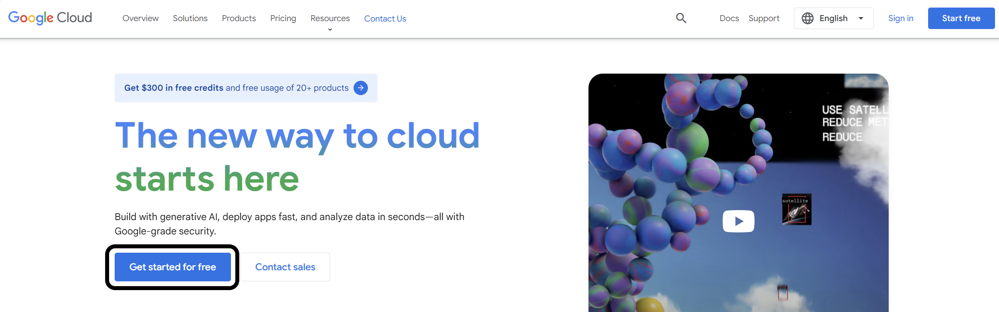
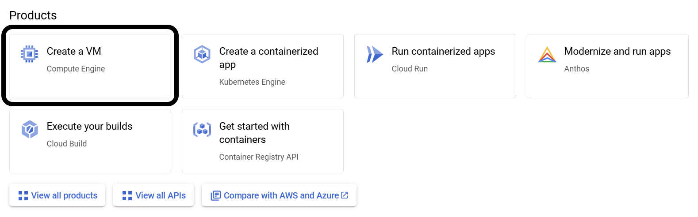
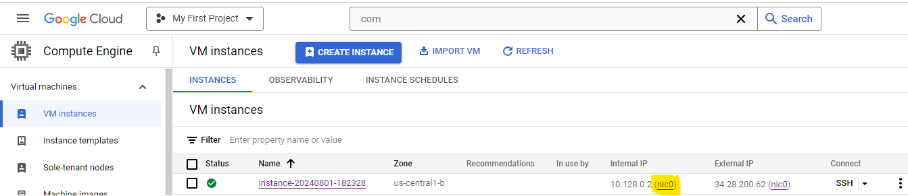
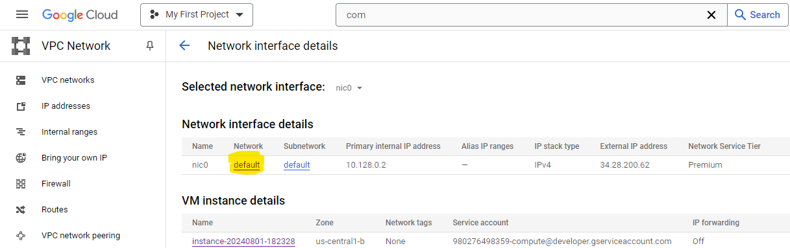
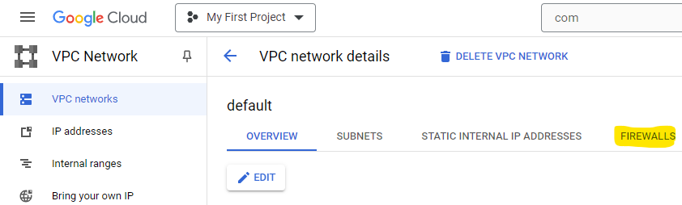

===================================
Day 1 - Google Cloud Platform Setup
===================================

Table of Contents
=================

* :ref:`Pre_requisites`
* :ref:`Accessing_GCP`
* :ref:`Creating_a_VM`
* :ref:`Demo_Testing`
* :ref:`Alternatives`

.. _Pre_requisites:

Pre-requisites
==============

* Google Account
* Active debit/credit card for identification
* Home address

.. note::

    The service will not charge you unless you specifically agree. This is solely to ensure that you are not a robot.

.. _Accessing_GCP:

Accessing GCP
=============

**Step 1:** Follow this link to GCP: `Google Cloud Platform <https://cloud.google.com>`_

**Step 2:** Click “Get started for free.”

**Step 3:** Login to your Google account.

**Step 4:** Follow on-screen instructions on signing up.

**Step 5:** Fill out the usage survey.

.. _Creating_a_VM:

Creating the Virtual Machine
============================

**Step 1:** Scroll down on the main page until you see the category titled “Products”

.. image:: GCP_i.png
    :alt: GCP image I

**Step 2:** Select the option "Create a VM"

**Step 3:** You will now see the Compute Engine API, click “Enable”

**Step 4:** Once the Compute Engine API is completed, you will see a VM Instances page. Click the button near the center of the screen labeled “Create Instance”

**Step 5:** Now that you are on the VM configuration screen, name the machine whatever you want (name must be lowercase, hyphen, and numbers). You should also apply the following configuration changes:

    **Step 5.1:** Select E2 under "Machine Configuration"

    **Step 5.2:** Under "Machine type", click "Custom" and set "Cores" to 24 vCPU (12 core) and change "Memory" to 48 GB

    **Step 5.3:** Under "Boot Disk", click "CHANGE".

        * Select "Ubuntu" from the "Operating system" dropdown menu

        * Select "Ubuntu 20.04 LTS" from the "Version" dropdown menu. Make sure it is the x86/64, amd64 image.

        * Change "Size (GB)" to 75 GB. Change this if you so desire.

        * Click "SELECT" to save and close these settings.

**Step 6:** Once all the configuration changes have been made, click "Create" at the bottom.

.. note::

    It may take a few minutes for the VM to install and come online. You can see each VM's power status from the "VM Instances" page.

.. _Demo_Testing:

Demo/Testing
============

Once the VM has finished installing and is set up, you can click on your newly created VM which will lead you to the VM’s information page. From here you can control power status, storage info, networking info, and more

.. note::

    In order to restart, you must stop then start the VM from the three-dot icon to the left of the “Equivalent Code” button, there is no “restart”

To get the IP of the machine, you can refer to the Networking Interfaces Section:

.. image:: GCP_iii.png
    :alt: GCP image III

In order to access the VM, you have to SSH into the machine. Google has their own browser based SSH client that you can do by clicking the “SSH” button at the top left under Details or you can choose another option via the little arrow to the right of the “SSH” button.

.. warning::

    When SSH-ing into the VM, we recommend using tmux as splitting the terminal proved to be easier than a bunch of separate tiny SSH sessions. This is primarly important for later in demos where 8-14 terminals is needed.

If a file is needed to be transferred from your machine to the VM or vise versa, you can choose from the two options at the top of the Google SSH client. In order to get a file, you must provide the absolute path of the file and to send a file it is done through a GUI interface.

.. _VNC-access:

VNC access (optional)
=====================

First, install VNC on the server:

VNC server Installation
-----------------------
Open an SSH connection then run the following commands:

.. code-block:: bash

    sudo apt update -y
    sudo apt install xvfb x11-utils tightvncserver icewm -y
    export DISPLAY=:0
    Xvfb &
    # Wait a bit for Xvfb to start up before running the following X applications.
    sleep 1
    # Enter a password below, perhaps "testing".
    tightvncserver

VNC firewall configuration
--------------------------
Now, open a port to allow VNC access:

Click on the ``nic0`` link:

Next, click on the ``default`` network:

Next, click on the ``Firewalls`` tab:

Next, click on the ``add firewall rule`` button, then set:

-   Name: ``vnc``
-   Targets: ``All instances in the network``
-   Source IPv4 ranges: ``0.0.0.0/0``
-   Check the TCP box under Protocols and ports, then enter a port of ``5900-5901``.
-   Click the ``Create`` button.

.. image:: firewall_create_rule1.png
.. image:: firewall_create_rule2.png

VNC client
----------
Download `tightVNC <https://www.tightvnc.com/download.php>`_, install it, then run it. Enter an address of **IP of the machine**\ ``::5901``; for example, ``34.28.200.62::5901``. (To determine your machine's IP address, see `Demo/Testing <Demo_Testing>`_.) Finally, press the Connect button. VNC should open; right-click then select Terminal.

.. _Alternatives:

Alternatives
============

In the case that you cannot use GCP, Azure by Microsoft has a similar service, but this option was not tested and may not work for you. Additionally, Azure has more limiting credit and time for their free credit. Other than these issues, the process should be similar to GCP and may work as an appropriate alternative.

    * Link to Azure's services: `Azure Cloud Computing Services <https://azure.microsoft.com/en-us>`_
