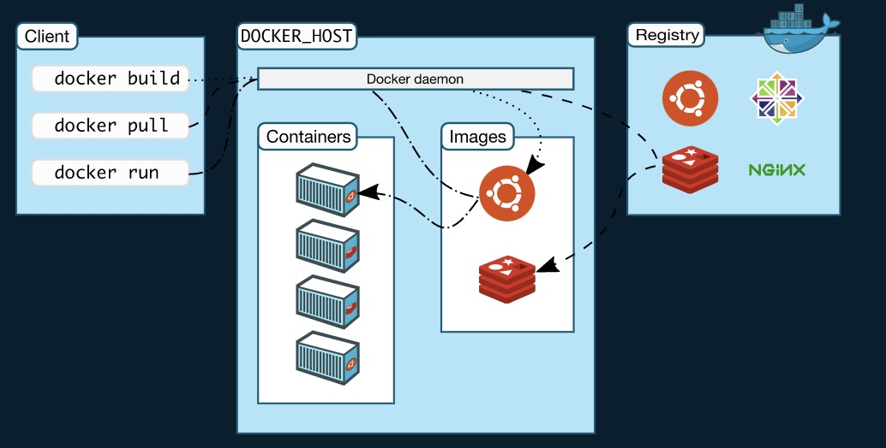

=======================================
Background on Docker, Kubernetes & Helm
=======================================

Docker
------

Docker is used to run and manage apps side-by-side in isolated environments 
called containers that contain everything needed to run the application to get 
better compute density.
So, you do not need to rely on what is currently installed on the host.
The isolation and security allow you to run many containers simultaneously on 
a given host.
The difference between a container and a Virtual Machine is that containers provide a way to virtualize
an OS so that multiple workloads can run on a single OS instance. With VMs, the hardware is being virtualized
to run multiple OS instances.

.. image:: vm_vs_docker.jpg
   :width: 90%
   :alt: VM v/s Container Implementation

Docker is used to build agile software delivery pipelines to ship new features 
faster, more securely and with repeatability for both Linux and Windows Server 
apps.

Core components of docker
-------------------------

Images
======

An image is a read-only template with instructions for creating a Docker container. Docker images may be based on
other images and is customized to contain executable application source code as well as all the tools, libraries,
and dependencies that the application code needs to run as a container. When you run the Docker image,
it becomes one instance (or multiple instances) of the container.

Containers
==========

Containers are encapsulated environments in which you run applications and is a runnable instance of an image.
A Docker container image is a lightweight, standalone, executable package of software that has everything you need
to run an application – code, runtime, system tools, system libraries, and settings. Containers only have access to
resources that are defined in the image, unless additional access is defined when building the image into a container.
For example, a container can access environment variables defined within it but cannot access environment variables of the host machine unless specified.
Since containers are much smaller than VMs, they can be spun up in a matter of seconds, and result in much better
server density. When a container is removed, any changes to its state that are not stored in persistent storage disappear.

Registry
========
The Docker Registry is where the Docker Images are stored and can be downloaded. The Registry can be either a user’s
local repository or a public repository like a Docker Hub (similar to GitHub) allowing multiple users to collaborate.
Images can be 'pushed' to and 'pulled' from the registries as and when required.

DockerFile
==========
A DockerFile is a text file that contains instructions on how to build a docker image.
A Dockerfile specifies the operating system that will underlie the container, along with the languages,
environmental variables, file locations, network ports, and other components it needs—and what the container
will do once we run it.

Kubernetes
----------

Kubernetes is an open-source platform for automating deployment, scaling, and 
operations of application containers across clusters of hosts, providing 
container-centric infrastructure. It is an automated platform that enables 
auto-placement, auto-restart, auto-replication, auto-scaling of application 
containers.

Kubernetes manages a cluster of Linux machines (might be cloud VM like AWS EC2 or physical servers), on each host machine, Kubernetes runs any number of 
Pods, in each Pod there can be any number of containers. User’s application is running in one of those containers.

Helm
----

Helm is a package manager for Kubernetes. It is the equivalent of 'yum' or 'apt' seen in Linux OS or 'pip' in the case of Python. Just as how 'apt' gets
and installs/deploys packaged applications on the Linux OS, Helm similarly deploys packaged applications (called Helm Charts)
on Kubernetes clusters. To understand how Helm charts are packaged and configured, basic understanding of YAML (Yet Another Markup Language) is helpful. YAML
files specify configuration-type information in a list/key-value format (similar to JSON). Configuration information can include name, version, labels, and other metadata.
It can also include container info like link to images, name of the Kubernetes pod and commands to run once the pod fires up. A bunch of these YAML files constitute a chart.
The Helm tool processes these charts and sends commands to a server running on Kubernetes called "tiller".

