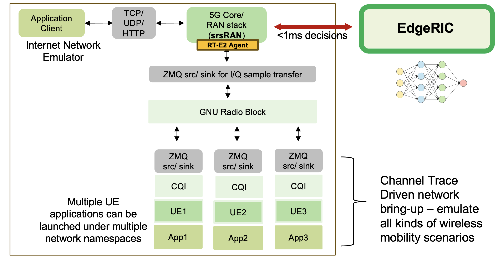
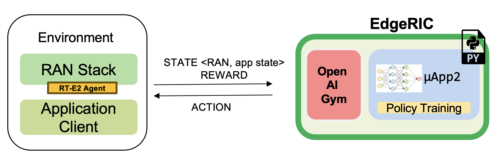

Day 2 - EdgeRIC tutorial 
------------------------
| Website: https://edgeric.github.io/
| Tutorial: https://edgeric.github.io/edgeric-workshop-tutorial.html


In this tutorial, we will go over the EdgeRIC architecture and installation of the srsRAN network facilitated with EdgeRIC hooks. We also provide a containerized version of our codebase. We will discuss how to write μApps. As an example, we will run a real-time MAC scheduler μApp that assigns scheduling decisions per UE for each TTI. We will look at multiple scheduling algorithms with this μApp to demonstrate the system behavior: ``Max Weight``, ``Max CQI``, ``Proportional Fairness``, ``Round Robin``, and ``an RL based scheduler``.

μApp demo: MAC scheduling
""""""""""""""""""""""""""
This μApp offers scheduling decisions to the RAN at the granularity of one TTI (~1ms). It adopts a weight-based approach for its decision. The weight of a UE corresponds to its relative priority to be scheduled given the current state of the system. We list the metrics used by this μApp below:

Metrics: ``ue_data[rnti]['Tx'], ue_data[rnti]['CQI'], ue_data[rnti]['BL']`` for each UE.

Actions Sent: ``weight_{i}`` which corresponds to the weight of each UE ``i``

RT-E2 Policy Format for this μApp: ``RNTI_{i}, weight_{i}`` where ``i`` corresponds to each UE.

Training Reinforcement Learning scheduling Policy
""""""""""""""""""""""""""

Here, we train an RL agent with the objective of **total system throughput maximization**. Listed below are the specifications for our training:

- Algorithm used: Proximal Policy Optimization
- State_space: [BL1,CQI1,BL2,CQI2.....]
- Action_space: ``[Weight1,Weight2.....]``
- Reward: Total system throughput

Install srsRAN supporting EdgeRIC hooks
""""""""""""""""""""""""""

We will be using Option 2 in this tutorial!

Option 1: Install on your system
^^^^^^^^^^^^^^^^^^^^^^^^^^^^^

You would need Ubuntu 20 to run this repository, with option 2 you can run on any Linux environment.

Dependencies and cloning the repository
===============

.. code-block:: bash

    sudo apt-get update
    sudo apt-get -y upgrade

    sudo apt-get install -y libfftw3-dev libmbedtls-dev libsctp-dev qt5-default libconfig++-dev net-tools nano libtool pkg-config build-essential autoconf automake git python3 python3-distutils python3-pip python3-apt libzmq3-dev python3-zmq software-properties-common

    sudo apt-get update
    sudo add-apt-repository ppa:gnuradio/gnuradio-releases
    sudo apt-get update
    sudo apt-get install -y gnuradio xterm python3-gi gobject-introspection gir1.2-gtk-3.0 iputils-ping iproute2 libx11-dev iperf

    sudo pip3 install --upgrade pip

    sudo pip3 install gym pandas torchvision tensorboard redis debugpy ray gymnasium dm_tree pyarrow typer scikit-image plotly
    sudo pip3 install hydra-core==1.1.0

    sudo pip3 uninstall -y protobuf
    sudo pip3 install protobuf==3.20.*

    git clone https://github.com/ushasigh/EdgeRIC-A-real-time-RIC.git
    git checkout oaic-workshop

Compile the protobuf message schema
===============

The protobuf schemas are found in ``srsran-enb/srsenb/protobufs`` for RAN and in ``edgeric`` for EdgeRIC.

**Compile the protobuf format for the RT-E2 agent**

.. code-block:: bash

    cd srsran-enb/srsenb/protobufs
    protoc --cpp_out=../rtagent metrics.proto ## RT-E2 Report Message
    protoc --cpp_out=../rtagent control_actions.proto ## RT-E2 Policy message
    cd ../../..

The generated ``metrics.pb.cc`` and ``control_actions.pb.cc`` are included in this repository, so this step can be skipped.

**Compile the protobuf format for EdgeRIC**

.. code-block:: bash

    cd edgeric
    protoc --python_out=. metrics.proto ## RT-E2 Report Message
    protoc --python_out=. control_actions.proto ## RT-E2 Policy message
    cd ..

The generated ``metrics_pb2.py`` and ``control_actions_pb2.py`` are included in this repository, so this step can be skipped.

Build the repository
===============

.. code-block:: bash

    ./make-ran.sh

All config files used in this tutorial are provided in ``.config``.

Option 2: Install the containerized version
^^^^^^^^^^^^^^^^^^^^^^^^^^^^^

We provide the Dockerfile to run this repository inside a container, the bash scripts account for development mode by mounting the docker volume to the local machine.

.. image:: edgeric-docker.png
   :alt: EdgeRIC docker
   :align: center

Let us first download and install the image of the compute environment.

**Terminal 0**

.. code-block:: bash

    git clone https://github.com/ushasigh/EdgeRIC-A-real-time-RIC.git
    cd EdgeRIC-A-real-time-RIC
    git checkout oaic-workshop

    sudo docker pull nlpurnhyun/edgeric_base_oaic

    # sudo ./dockerbuild_edgeric_oaic.sh

    sudo ./dockerrun_edgeric_oaic.sh host 0

Building the srsRAN with EdgeRIC support
===============

.. code-block:: bash

    ./make_ran.sh

**Note on Channel Emulation**  

We use a modified version of the ``srsue`` codebase to account for channel variation. The channel is abstracted by the CQI (Channel Quality Indicator) - a 5G MAC layer parameter defined to represent the wireless environment.



Included in this repository are the CQI trace datasets obtained from an extensive measurement drive. The traces can be found in ``srsran-ue/cqis``.

How to run the network
===============

**Running in Docker container:**  

Run the following on every terminal before running the following set of commands.

.. code-block:: bash

    cd EdgeRIC-A-real-time-RIC
    sudo ./dockerexec_edgeric_oaic.sh 0

**Running natively:** Use ``sudo`` for running all the commands.

Setup the core and srsenb
===============

**Terminal 1**: Run the GRC broker. We will run a 2UE scenario.

.. code-block:: bash

    python3 top_block_2ue_no_gui.py # OR ./top_block_2ue_23.04MHz.py if you have GUI support

This step is not needed in over-the-air mode.

**Terminal 2**: Run the EPC.

.. code-block:: bash

    ./run_epc.sh

**Terminal 3**: Run the enb.

.. code-block:: bash

    ./run_enb.sh

Run the UEs
===============

First, add the UE namespaces.

**Terminal 4:**  

.. code-block:: bash

    ip netns add ue1
    ip netns add ue2

In this repository, we will use the modified ``srsue`` codebase provided in ``srsran-ue``, which provides support to run UE with a specified channel trace collected from real-world experiments. [In our case, the channel is represented by CQI]

**Updating the CQI channel trace**: File under concern: ``srsran-ue/params{1}.txt`` for ue {i}, update line 5 with the desired CQI file, which should be present in folder ``srsran-ue/cqis``.

.. code-block:: text

    File: params1.txt
    2
    1 7
    1
    ../cqis/random_1.txt
    60000
    # in line 1 First: period of cqi emulation 
    # in line 2 First: minimum of cqi emulation
    # in line 2 Second: of maximum cqi emulation
    # If in line 2 both values are zero, it reads a file to get realistic cqi data.
    # in line 3 First: initial value of cqi emulation
    # in line 4: filename of cqi trace 
    # in line 5: number of data 

**Option 1:** Run automated scripts for 2 UEs:

**Terminal 4:**  

.. code-block:: bash

    ./run_srsran_2ue.sh 

Press ``t`` to view the UE metrics on the console.

**Option 2:** Run the UEs on separate terminals

.. code-block:: bash

    cd srsran-ue/build

Run UE1:

.. code-block:: bash

    sudo ./srsue/src/srsue ../.config/ue1.conf --rf.device_name=zmq --rf.device_args="tx_port=tcp://*:2001,rx_port=tcp://localhost:2000,id=ue,base_srate=23.04e6" --gw.netns=ue1 --params_filename="../params1.txt"

Run UE2: 

.. code-block:: bash

    sudo ./srsue/src/srsue2 ../.config/ue2.conf --rf.device_name=zmq --rf.device_args="tx_port=tcp://*:2011,rx_port=tcp://localhost:2010,id=ue,base_srate=23.04e6" --gw.netns=ue2 --params_filename="../params2.txt"

Press ``t`` to view the UE metrics on the console.

Known Issue
===============

**Make sure you have an immediate UE attach; UEs should not try to reattach**. After every run, a clean build may be necessary; otherwise, UEs may not attach. Run the following inside the container:

**Terminal 0**

.. code-block:: bash

    ./stop_ran.sh
    ./make_ran.sh

**What does immediate attach look like**

.. code-block:: text

    Attaching UE...
    Closing stdin thread.
    Current sample rate is 1.92 MHz with a base rate of 23.04 MHz (x12 decimation)
    Current sample rate is 1.92 MHz with a base rate of 23.04 MHz (x12 decimation)
    . # of cqis: 60000 done!
    Attaching UE...
    Closing stdin thread.
    Current sample rate is 1.92 MHz with a base rate of 23.04 MHz (x12 decimation)
    Current sample rate is 1.92 MHz with a base rate of 23.04 MHz (x12 decimation)
    .

    Found Cell:  Mode=FDD, PCI=1, PRB=25, Ports=1, CP=Normal, CFO=-0.2 KHz
    Found Cell:  Mode=FDD, PCI=1, PRB=25, Ports=1, CP=Normal, CFO=-0.2 KHz
    Current sample rate is 5.76 MHz with a base rate of 23.04 MHz (x4 decimation)
    Current sample rate is 5.76 MHz with a base rate of 23.04 MHz (x4 decimation)
    Current sample rate is 5.76 MHz with a base rate of 23.04 MHz (x4 decimation)
    Current sample rate is 5.76 MHz with a base rate of 23.04 MHz (x4 decimation)
    Found PLMN:  Id=00101, TAC=7
    Found PLMN:  Id=00101, TAC=7
    Random Access Transmission: seq=9, tti=341, ra-rnti=0x2
    Random Access Transmission: seq=20, tti=341, ra-rnti=0x2
    RRC Connected
    Random Access Complete.     c-rnti=0x46, ta=0
    RRC Connected
    Random Access Complete.     c-rnti=0x47, ta=0
    Network attach successful. IP: 172.16.0.2
    Network attach successful. IP: 172.16.0.3
    Software Radio Systems RAN (srsRAN) 5/8/2024 22:38:19 TZ:0
    Software Radio Systems RAN (srsRAN) 5/8/2024 22:38:19 TZ:0

If you do not observe this, please rebuild srsRAN by running ``./make_ran.sh``.

Stream Traffic:
===============

The traffic generators are located in the folder ``/traffic-generator``.

Running Downlink iperf traffic
===============

**Terminal 5:** 

.. code-block:: bash

    cd traffic-generator
    ./iperf_server_2ues.sh

**Terminal 6:** 

.. code-block:: bash

    cd traffic-generator
    # ./iperf_client_2ues.sh <rate_ue{i}> <duration>, eg: below
    ./iperf_client_2ues.sh 21M 5M 10000

Running EdgeRIC
===============

**Terminal 7:** 

.. code-block:: bash

    cd edgeric
    redis-server

EdgeRIC messenger
===============

.. code-block:: bash

    edgeric_messenger
    ├── get_metrics_multi()  # get_metrics(): receive metrics from RAN, called by all μApps
    │   ├── returns ue_data dictionary
    ├── send_scheduling_weight() # send the RT-E2 scheduling policy message to RAN

μApps supported in this codebase
===============

.. code-block:: bash

    ├── /muApp1           # weight based abstraction of downlink scheduling control
    │   ├── muApp1_run_DL_scheduling.py
    ├── /muApp2           # training an RL agent to compute downlink scheduling policy
        ├── muApp2_train_RL_DL_scheduling.py
    ├── /muApp3           # Monitoring the realtime metrics
        ├── muApp3_monitor.py    

Running muApp1 - downlink scheduler
===============

**Weight Based abstraction of control** The scheduling logic in ``srsenb`` is updated to support a weight-based abstraction to allocate the number of RBGs to allocate per UE. A weight-based abstraction allows us to implement any kind of scheduling policy where we provide a weight ``w_i`` for each UE, the RAN then allocates ``[w_i*available_rbgs]`` RBGs to each UE.     

**Terminal 8:** 

.. code-block:: bash

    cd edgeric
    cd muApp1
    redis-cli set scheduling_algorithm "Max CQI" # setting an initial scheduler
    python3 muApp1_run_DL_scheduling.py # sudo not required if you are running in docker

Setting the scheduler algorithm manually
===============

Set the scheduling algorithm you want to run:

.. code-block:: bash

    # Line 259
    selected_algorithm = "Max CQI"   # selection can be: Max CQI, Max Weight,
                                     # Proportional Fair (PF), Round Robin 
                                     # RL - models are included for 2 UEs

If the algorithm selected is RL, set the directory for the RL model:

.. code-block:: bash

    # Line 270
    rl_model_name = "Fully Trained Model"  # selection can be Initial Model,
                                           # Half Trained Model, Fully Trained Model - to see benefits, run UE1 with load 5Mbps, UE2 with 21Mbps

The respective models are saved in:

.. code-block:: bash

    ├── ../rl_model/           
        ├── initial_model 
          ├──model_demo.pt
        ├── half_trained_model 
          ├──model_demo.pt
        ├── fully_trained_model 
          ├──model_demo.pt

Using redis to update the scheduling algorithm
===============

**Terminal 9:**

.. code-block:: bash

    redis-cli set scheduling_algorithm "Max Weight" #selection can be: Max CQI, Max Weight,
                                                    # Proportional Fair (PF), Round Robin
                                                    # RL - models are included for 2 UEs

**What to observe**  

**Terminal 3** - srsenb terminal will show the scheduling allocations

.. code-block:: text

    time: 1722802166592145 rnti: 70 alloc_mask: 1111111000000 # the 1s indicate the PRBs allocated to RNTI 70
    time: 1722802166592178 rnti: 71 alloc_mask: 0000000111111 # the 1s indicate the PRBs allocated to RNTI 71
    time: 1722802168789991 rnti: 71 alloc_mask: 1111110000000 
    time: 1722802168790027 rnti: 70 alloc_mask: 0000001111111 
    time: 1722802170990251 rnti: 70 alloc_mask: 1111111000000 
    time: 1722802170990285 rnti: 71 alloc_mask: 0000000111111 
    time: 1722802173211321 rnti: 70 alloc_mask: 1111111000000 
    time: 1722802173211351 rnti: 71 alloc_mask: 0000000111111 
    time: 1722802175402790 rnti: 71 alloc_mask: 1111110000000 
    time: 1722802175402823 rnti: 70 alloc_mask: 0000001111111 

**Terminal 8** - muApp1 terminal will show the algorithms selected and will print the total average system throughput observed

.. code-block:: text

    Algorithm index:  2  ,  Max Weight
    total system throughput: 8.781944 

    Algorithm index:  2  ,  Max Weight
    total system throughput: 8.063600000000001 

    Algorithm index:  2  ,  Max Weight
    total system throughput: 8.093352 

    Algorithm index:  2  ,  Max Weight
    total system throughput: 8.071168 

**Terminal 9** - To observe the throughput updates, let us update the scheduler with the following command:

.. code-block:: bash

    redis-cli set scheduling_algorithm "RL" 

**Terminal 8** - Increased system throughput observed with our trained RL model

.. code-block:: text

    Algorithm index:  20  ,  RL
    Executing RL model at: ./rl_model/fully_trained_model
    total system throughput: 12.071200000000001 

    Algorithm index:  20  ,  RL
    Executing RL model at: ./rl_model/fully_trained_model
    total system throughput: 11.727624 

    Algorithm index:  20  ,  RL
    Executing RL model at: ./rl_model/fully_trained_model
    total system throughput: 11.714879999999999 

    Algorithm index:  20  ,  RL
    Executing RL model at: ./rl_model/fully_trained_model
    total system throughput: 11.710384 

    Algorithm index:  20  ,  RL
    Executing RL model at: ./rl_model/fully_trained_model
    total system throughput: 11.743776 

Running muApp3 - Monitoring
===============

This muApp will help us see the RT-E2 Report Message from the RAN and the RT-E2 Policy message sent to RAN.

**Terminal 10:**

.. code-block:: bash

    cd edgeric/muApp3
    python3 muApp3_monitor_terminal.py 

**What to observe**  

.. code-block:: text

    RT-E2 Report: 

    RAN Index: 791000, RIC index: 790998 

    UE Dictionary: {70: {'CQI': 7, 'SNR': 115.46858215332031, 'Backlog': 384977, 'Pending Data': 0, 'Tx_brate': 1980.0, 'Rx_brate': 0.0}, 71: {'CQI': 8, 'SNR': 116.41766357421875, 'Backlog': 1503, 'Pending Data': 0, 'Tx_brate': 0.0, 'Rx_brate': 0.0}} 

    RT-E2 Policy (Scheduling): 
    Sent to RAN: ran_index: 790999
    weights: 70.0
    weights: -0.15028022229671478
    weights: 71.0
    weights: 1.150280237197876

Running muApp2 - Training an RL policy for scheduling
===============



We are training a PPO agent with the objective of throughput maximization in this particular study.

Usage
===============

.. code-block:: bash

    cd muApp2
    python3 muApp2_train_RL_DL_scheduling.py --config-name=edge_ric

muApp2_train_RL_DL_scheduling.py
===============

* Trains PPO agent for ```num_iters``` number of iterations
    * One iteration consists of training on 2048 samples and evaluating for 2048 timesteps
    * The evaluation metric (avg reward per episode) is plotted as the training graph
    * ``outputs/`` folder will save the training log, ``eval_R_avg`` is the metric plotted to visualize the training


Repo Structure
===============

.. code-block:: bash

    ├── conf
    │   ├── edge_ric.yaml   # Config file for edgeric RL training
    │   ├── example.yaml
    │   ├── simpler_streaming.yaml
    │   └── single_agent.yaml
    ├── outputs # Output logs of each training sorted chronologically
    │   ├── 2022-10-07
             ├── model_best.pt # Saved policy neural network weights
    │          .
    │          .
    │          .
    │          
    └── ../stream_rl # Name of the python package implementing the simulator mechanisms
        ├── callbacks.py
        ├── envs # All the envs
        │   ├── cqi_traces
        │   │   ├── data.csv # CQI trace to be used by simulation env
        │   │   └── trace_generator.py # Code to generate synthetic CQI traces
        │   ├── edge_ric.py # Our Env 
        │   ├── simpler_streaming_env.py
        │   ├── single_agent_env.py
        │   └── streaming_env.py
        │   └── __init__.py
        ├── __init__.py
        ├── plots.py # All plotting code
        ├── policy_net # Custom policy net architectures (not currently used)
        │   ├── conv_policy.py
        │   ├── __init__.py
        ├── registry # Registry system for registering envs and rewards (to keep things modular)
        │   └── __init__.py
        └── rewards.py # Definition of reward functions to be used in envs

Once the training completes: take the model_best.pt and save in the ../rl_model folder

EdgeRIC Env (edge_ric.py)
===============

* State_space : ``[BL1,CQI1,BL2,CQI2.....]`` (if augmented_state_space=False)
* Action_space : ``[Weight1,Weight2.....]``
* Parameters of the env configurable in ``"./conf/edge_ric.yml"``, under ``env_config`` field


