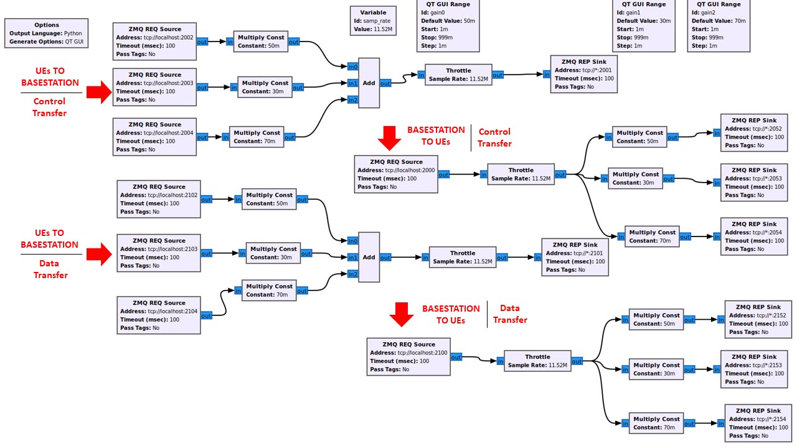

===================================
Multiple UEs with ZMQ in 5G Example 
===================================

Video guide: https://www.youtube.com/watch?v=n6Bp1sNcQeU

This example uses a gnuradio flowgraph (broker) to establish the connection between 3 UEs with 5G.

Below is a flowgraph for gnuradio that makes the connection among the uplink and downlink channels for each UE. You will need the free and open source software Gnu Radio which can be obtained on Ubuntu by running:

.. code-block:: bash

   sudo apt install gnuradio 

Please download this file to be run later in the example: 
https://github.com/openaicellular/main-file-repo/blob/master/3ue_NR_OAIC.grc

GNU Radio Walkthrough
=====================

This program will help establish an uplink and downlink connection between the srsUE and the srsENodeB for both control and data transfer

Setup 
======

Check and edit the conf file in /root/.config/srsran/user_db.csv, make sure it has the following:

.. code-block:: bash

    ue2,xor,001010123456780,00112233445566778899aabbccddeeff,opc,63bfa50ee6523365ff14c1f45f88737d,8000,00000000131b,7,dynamic
    ue4,xor,001010123456787,00112233445566778899aabbccddeeff,opc,63bfa50ee6523365ff14c1f45f88737d,9002,000000001276,7,dynamic
    ue3,xor,001010123456788,00112233445566778899aabbccddeeff,opc,63bfa50ee6523365ff14c1f45f88737d,8001,0000000012b8,7,dynamic
    ue1,xor,001010123456789,00112233445566778899aabbccddeeff,opc,63bfa50ee6523365ff14c1f45f88737d,9001,00000000135d,7,dynamic

In a terminal run the following commands for each UE:

.. code-block:: bash

    sudo ip netns add ue1
    sudo ip netns add ue2
    sudo ip netns add ue3

Check how many UEs:

.. code-block:: bash

    sudo ip netns list

Running the example 
===================

Terminal 1: Start the Core Network

.. code-block:: bash

    sudo srsepc

Terminal 2: Set up Environment Variables and Base Station

.. code-block:: bash

    export E2NODE_IP=`hostname  -I | cut -f1 -d' '`
    export E2NODE_PORT=5006
    export E2TERM_IP=`sudo kubectl get svc -n ricplt --field-selector metadata.name=service-ricplt-e2term-sctp-alpha -o jsonpath='{.items[0].spec.clusterIP}'`
    
.. code-block:: bash

    sudo srsenb --enb.n_prb=50 --enb.name=enb1 --enb.enb_id=0x19B --rf.device_name=zmq --rf.device_args="fail_on_disconnect=true,tx_port0=tcp://*:2000,rx_port0=tcp://localhost:2001,tx_port1=tcp://*:2100,rx_port1=tcp://localhost:2101,id=enb,base_srate=23.04e6" --ric.agent.remote_ipv4_addr=${E2TERM_IP} --log.all_level=warn --ric.agent.log_level=debug --log.filename=stdout --ric.agent.local_ipv4_addr=${E2NODE_IP} --ric.agent.local_port=${E2NODE_PORT}

Terminal 3: Set up the First UE

.. code-block:: bash

    sudo srsue --rf.device_name=zmq --rf.device_args="fail_on_disconnect=true,tx_port0=tcp://*:2002,rx_port0=tcp://localhost:2052,tx_port1=tcp://*:2102,rx_port1=tcp://localhost:2152,id=ue1,base_srate=23.04e6" --gw.netns=ue1 --usim.algo=xor --usim.imsi=001010123456789

Terminal 4: Set up the Second UE

.. code-block:: bash

    sudo srsue --rf.device_name=zmq --rf.device_args="fail_on_disconnect=true,tx_port0=tcp://*:2003,rx_port0=tcp://localhost:2053,tx_port1=tcp://*:2103,rx_port1=tcp://localhost:2153,id=ue2,base_srate=23.04e6" --gw.netns=ue2 --usim.algo=xor --usim.imsi=001010123456780

Terminal 5: Set up the Third UE

.. code-block:: bash

    sudo srsue --rf.device_name=zmq --rf.device_args="fail_on_disconnect=true,tx_port0=tcp://*:2004,rx_port0=tcp://localhost:2054,tx_port1=tcp://*:2104,rx_port1=tcp://localhost:2154,id=ue3,base_srate=23.04e6" --gw.netns=ue3 --usim.algo=xor --usim.imsi=001010123456788

Open gnuradio companion and run the provided grc file by opening the file and pressing the play button.

After you execute the grc file, Ping and Iperf test can now be performed to measure performance or generate traffic to each connected UE.

Testing the Network
-------------------

PING
~~~~

Uplink
******

.. code-block:: bash

    sudo ip netns exec ue1 ping 172.16.0.1
    sudo ip netns exec ue2 ping 172.16.0.1
    sudo ip netns exec ue3 ping 172.16.0.1

Downlink
********

.. code-block:: bash

    sudo ping 172.16.0.2
    sudo ping 172.16.0.3
    sudo ping 172.16.0.4
    
iPerf3
~~~~~~

Network Side
************

.. code-block:: bash

    sudo iperf3 -s -i 1

UE-Side
*******
    
.. code-block:: bash

    sudo ip netns exec ue1 iperf3 -c 172.16.0.1 -b 10M -i 1 -t 60
    sudo ip netns exec ue2 iperf3 -c 172.16.0.1 -b 10M -i 1 -t 60
    sudo ip netns exec ue3 iperf3 -c 172.16.0.1 -b 10M -i 1 -t 60
    
