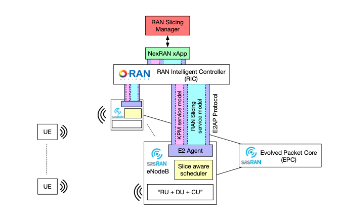

=======================
Running the Nexran Xapp 
=======================

Overview
========

The xapp is deployed in the near real time ric (3rd party APP). This deployed xapp then performs its functionality which in this case is RAN slicing. 

Powder’s Nexran xapp implements ran slicing by sending instructions to RAN nodes, that performs custom resource allocation and we bind UE’s to those slices of allocated resources.

The xapp has a southbound interface to the RIC where it can send commands down to the nodes and a northbound interface where high level commands can be issued by the user.

Setup 
=====

First we need to clone down the srslte modified with e2 specifically for NEXRAN

.. code-block:: bash

    cd oaic
    git clone https://github.com/openaicellular/srslte-e2
    cd srslte-e2

.. code-block:: bash
    
    rm -rf build
    mkdir build
    export SRS=`realpath .`
    cd build
    cmake ../ -DCMAKE_BUILD_TYPE=RelWithDebInfo \
        -DRIC_GENERATED_E2AP_BINDING_DIR=${SRS}/e2_bindings/E2AP-v01.01 \
        -DRIC_GENERATED_E2SM_KPM_BINDING_DIR=${SRS}/e2_bindings/E2SM-KPM \
        -DRIC_GENERATED_E2SM_GNB_NRT_BINDING_DIR=${SRS}/e2_bindings/E2SM-GNB-NRT
    make -j`nproc`
    make test
    sudo make install
    sudo ldconfig
    sudo srslte_install_configs.sh user --force
    cd ../../

We can now clone the repositories we will need to run build the xapp and onboard it as well as run multiple ues

.. warning::
    Make sure you open a new terminal before you run these following commands. This prevents you from downloading anything under the root directory

Under the oaic directory, run the following commands

.. code-block:: bash

    git clone https://github.com/openaicellular/nexran.git

 
Now we are going to build the xapp from the dockerfile

.. code-block:: bash

    cd ~/oaic/nexran
    
    sudo docker build . -t xApp-registry.local:5008/nexran:0.1.0

Paste the following in the ``nexran-onboard.url`` file. Substitue the ``<machine_ip_addr>`` with the IP address of your machine. You can find this out through ``ifconfig``.

.. code-block:: bash

	{"config-file.json_url":"http://<machine_ip_addr>:5010/config-file.json"}

Running the xapp
========================= 

Terminal 1: Start the Core Network/Ues

.. code-block:: bash

    sudo ip netns add ue1
    sudo srsepc 

Terminal 2: Set up Environment Variables and Base Station

.. code-block:: bash

    export E2NODE_IP=`hostname  -I | cut -f1 -d' '`
    export E2NODE_PORT=5006
    export E2TERM_IP=`sudo kubectl get svc -n ricplt --field-selector metadata.name=service-ricplt-e2term-sctp-alpha -o jsonpath='{.items[0].spec.clusterIP}'`
    

.. code-block:: bash
        
    sudo srsenb \
    --enb.n_prb=50 --enb.name=enb1 --enb.enb_id=0x19B --rf.device_name=zmq \
    --rf.device_args="fail_on_disconnect=true,tx_port=tcp://*:2000,rx_port=tcp://localhost:2001,id=enb,base_srate=23.04e6" \
    --ric.agent.remote_ipv4_addr=${E2TERM_IP} --log.all_level=warn --ric.agent.log_level=debug --log.filename=stdout \
    --ric.agent.local_ipv4_addr=${E2NODE_IP} --ric.agent.local_port=${E2NODE_PORT} \
    --slicer.enable=1 --slicer.workshare=0

Terminal 3: Set up the first UE

.. code-block:: bash

    sudo srsue \
      --rf.device_name=zmq --rf.device_args="tx_port=tcp://*:2001,rx_port=tcp://localhost:2000,id=ue,base_srate=23.04e6" \
    --usim.algo=xor --usim.imsi=001010123456789 --usim.k=00112233445566778899aabbccddeeff --usim.imei=353490069873310 \
    --log.all_level=warn --log.filename=stdout --gw.netns=ue1

Terminal 4: Iperf test on server side

.. code-block:: bash

   sudo ip netns exec ue1 iperf -s -p 5010 -i 4 -t 36000

Terminal 5: Iperf test on client side

.. code-block:: bash

   iperf -c 172.16.0.2 -p 5010 -i 4 -t 36000

Terminal 6

.. code-block:: bash
    
    cd nexran
    export KONG_PROXY=`sudo kubectl get svc -n ricplt -l app.kubernetes.io/name=kong -o jsonpath='{.items[0].spec.clusterIP}'`
    export E2MGR_HTTP=`sudo kubectl get svc -n ricplt --field-selector metadata.name=service-ricplt-e2mgr-http -o jsonpath='{.items[0].spec.clusterIP}'`
    export APPMGR_HTTP=`sudo kubectl get svc -n ricplt --field-selector metadata.name=service-ricplt-appmgr-http -o jsonpath='{.items[0].spec.clusterIP}'`
    export E2TERM_SCTP=`sudo kubectl get svc -n ricplt --field-selector metadata.name=service-ricplt-e2term-sctp-alpha -o jsonpath='{.items[0].spec.clusterIP}'`
    export ONBOARDER_HTTP=`sudo kubectl get svc -n ricplt --field-selector metadata.name=service-ricplt-xapp-onboarder-http -o jsonpath='{.items[0].spec.clusterIP}'`
    export RTMGR_HTTP=`sudo kubectl get svc -n ricplt --field-selector metadata.name=service-ricplt-rtmgr-http -o jsonpath='{.items[0].spec.clusterIP}'`

Deploying the xApp
------------------

.. code-block:: bash

    curl -L -X POST "http://$KONG_PROXY:32080/onboard/api/v1/onboard/download" --header 'Content-Type: application/json' --data-binary "@nexran-onboard.url"
    curl -L -X GET "http://$KONG_PROXY:32080/onboard/api/v1/charts"
    curl -L -X POST "http://$KONG_PROXY:32080/appmgr/ric/v1/xapps" --header 'Content-Type: application/json' --data-raw '{"xappName": "nexran"}'

If you already have NEXRAN xApp deployed on your system, you need to restart the pod using the command below before running the rest of the commands

.. code-block:: bash

    sudo kubectl -n ricxapp rollout restart deployment ricxapp-nexran

Add another terminal to print the NEXRAN logs

.. code-block:: bash

    sudo kubectl logs -f -n ricxapp -l app=ricxapp-nexran

.. warning::
    Before running the rest of the commands, detach one of the terminal with the iperf test running to observe the downlink traffic
    Also, detach the terminal with the NEXRAN logs 

.. code-block:: bash

    export NEXRAN_XAPP=`kubectl get svc -n ricxapp --field-selector metadata.name=service-ricxapp-nexran-rmr -o jsonpath='{.items[0].spec.clusterIP}'`

    echo NEXRAN_XAPP=$NEXRAN_XAPP echo ; echo

Now run the test script with the following commands

.. code-block:: bash

    chmod +x zmqoneue.sh
    ./zmqoneue.sh

Observe a slight change in the throughput in the detached terminal

Now run these commands to invert the fast and slow slices 

.. code-block:: bash

    
    curl -i -X PUT -H "Content-type: application/json" -d '{"allocation_policy":{"type":"proportional","share":1024}}' http://${NEXRAN_XAPP}:8000/v1/slices/slow ; echo ; echo ;
    curl -i -X PUT -H "Content-type: application/json" -d '{"allocation_policy":{"type":"proportional","share":256}}' http://${NEXRAN_XAPP}:8000/v1/slices/fast ; echo ; echo

Observe large change in the throughput in the detached terminal
