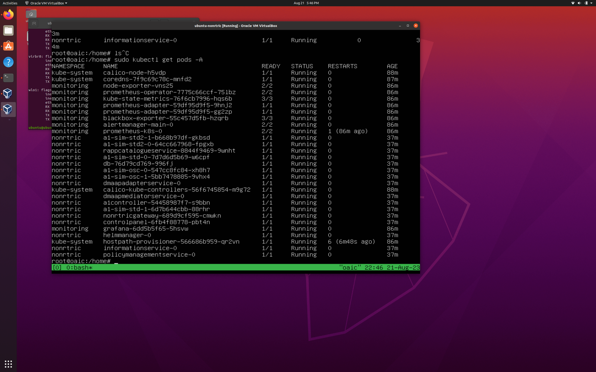
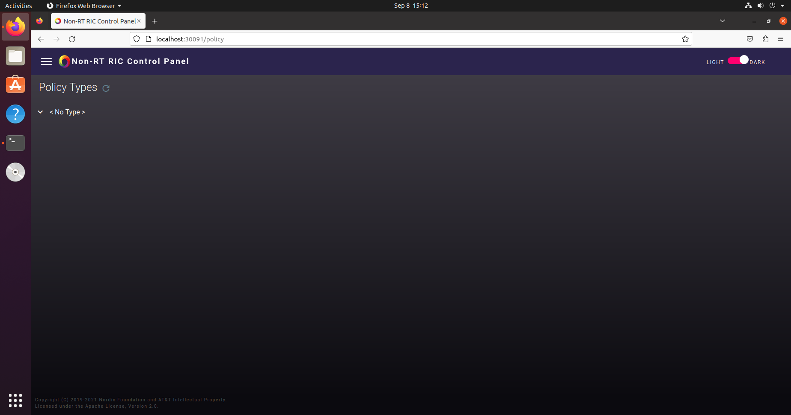
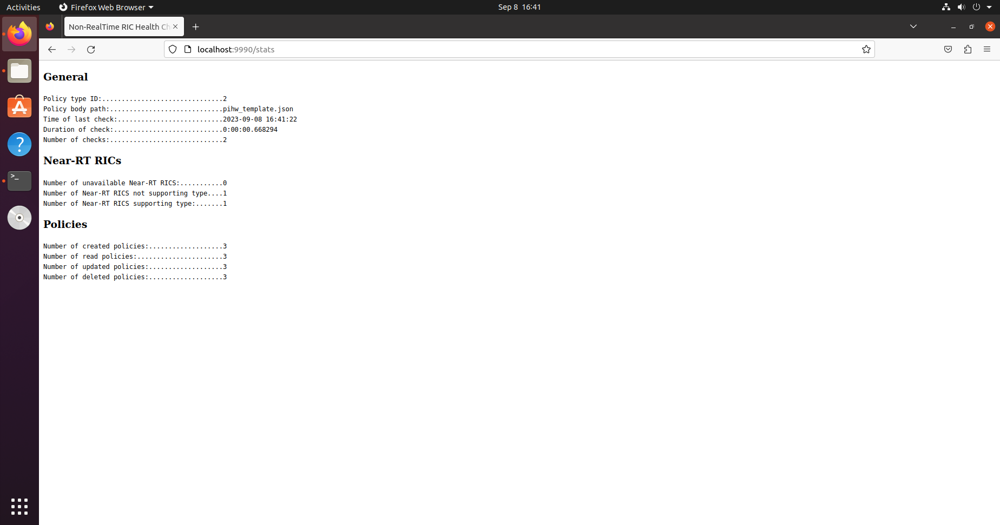

===========================================
O-RAN Non-Real Time RIC Installation Guide
===========================================

Pre-requisites
==============

System Requirements
-------------------
For Non-SMO installation

.. note::

    We recommend you to run these installation procedures on a machine with the specs below

* OS: `Ubuntu Desktop 20.04 LTS (Focal Fossa) <https://www.releases.ubuntu.com/focal/ubuntu-20.04.6-desktop-amd64.iso>`_
* CPU(s): 6 vCPUs
* RAM: 40 GB
* Storage: 60 GB

Installing the Non-Real Time RIC
================================

First install packages and reboot.

.. code-block:: bash

    sudo apt-get install snapd -y
    sudo apt-get install curl
    sudo apt-get install git
    sudo reboot
   
After your machine have finished rebooting git clone the following repositories into your home directory

.. code-block:: bash

    cd ~/
    git clone https://github.com/openaicellular/nonrtric.git
    git clone https://github.com/openaicellular/main-file-repo.git

The nonrtric repo will contain all the scripts to deploy the Non-Real Time RIC, and the main-file-repo repository will contain all the materials to deploy it.
   
Run these following commands to setup Kubernetes,

.. code-block:: bash

    cd ~/
    sudo ./nonrtric/smo-install/scripts/layer-0/0-setup-microk8s.sh
    
Chart Museum,

.. code-block:: bash

    sudo ./nonrtric/smo-install/scripts/layer-0/0-setup-charts-museum.sh
    
and Helm v3

.. code-block:: bash

    sudo ./nonrtric/smo-install/scripts/layer-0/0-setup-helm3.sh
   
Build the helm charts for the Non-Real Time RIC

.. code-block:: bash

    sudo ./nonrtric/smo-install/scripts/layer-1/1-build-all-charts.sh
  
.. note::

    This make take around 30 minutes

Finally, deploy the Non-Real Time RIC

.. code-block:: bash

    cd ~/nonrtric/bin
    sudo ./deploy-nonrtric -f ../RECIPE_EXAMPLE/NONRTRIC/example_recipe.yaml
   
Run this command to get all your pods.

.. code-block:: bash

    sudo kubectl get pods -A
   
Here are the results after you run the command.

   
.. note::

    It may take a while for all your pods to start running
    
After all your pods have came up, go to your browser and type in ``localhost:30091/policy`` to view the interface for the Policy Management Service pod.

The final results should look something like this

    
    
Healthcheck rApp Simulator
==========================

Introduction
-------------

The Health Check use case test provides a python script that regularly creates, reads, updates, and deletes a policy in all Near-RT RICs that support the type used by the script. A self refreshing web page provides a view of statistics for these regular checks.

Running the Non-Real Time RIC Healthcheck rApp
----------------------------------------------

First install all the package(s) that is required to run this rApp.

.. code-block:: bash

    sudo apt-get install docker.io
    sudo apt-get install python3-pip
   
Git clone the rapp-healthcheck into your home directory. The rapp-healthcheck repo will contain all the scripts to run an example rApp using the nonrtric components policymanagementservice(PMS) and the A1 simulators to simulate rics.

.. code-block:: bash

    cd ~/
    git clone https://github.com/openaicellular/rapp-healthcheck.git
    
Go into the repo's ``src`` folder and install all the python dependencies.

.. code-block:: bash

    cd ~/rapp-healthcheck/src/
    pip install -r requirements.txt
    
Go to the ``test`` folder and run the ``start.sh`` script

.. note::

    Please check and make sure your ``start.sh`` script has the right versions of PMS and A1 simulator specified.

.. code-block:: bash

    cd ~/rapp-healthcheck/test/
    sudo ./start.sh
    
The script will finish when the policy type is registered and synched in PMS.

Now go to the ``src`` folder and start the use cases

.. code-block:: bash

    cd ~/rapp-healthcheck/src/
    python3 main.py
    
As default, the script uses the "Hello World" policy type with ID "2". To create the instances it uses the body file ``rapp-healthcheck/src/pihw_template.json``. The body file contains the string "XXX" as a parameter value. This string will be replaced with dynamic data during creation. It is possible to provide a custom policy type and body file to the script at startup.

To see the web page, navigate to ``localhost:9990/stats``. The page refreshes itself with the same interval as the script uses.

Your results look something like this

   
To stop PMS and the simulators, run the ``stop.sh`` script.

.. code-block:: bash

    cd ~/rapp-healthcheck/test/
    sudo ./stop.sh

Source: https://github.com/o-ran-sc/nonrtric-rapp-healthcheck
    
