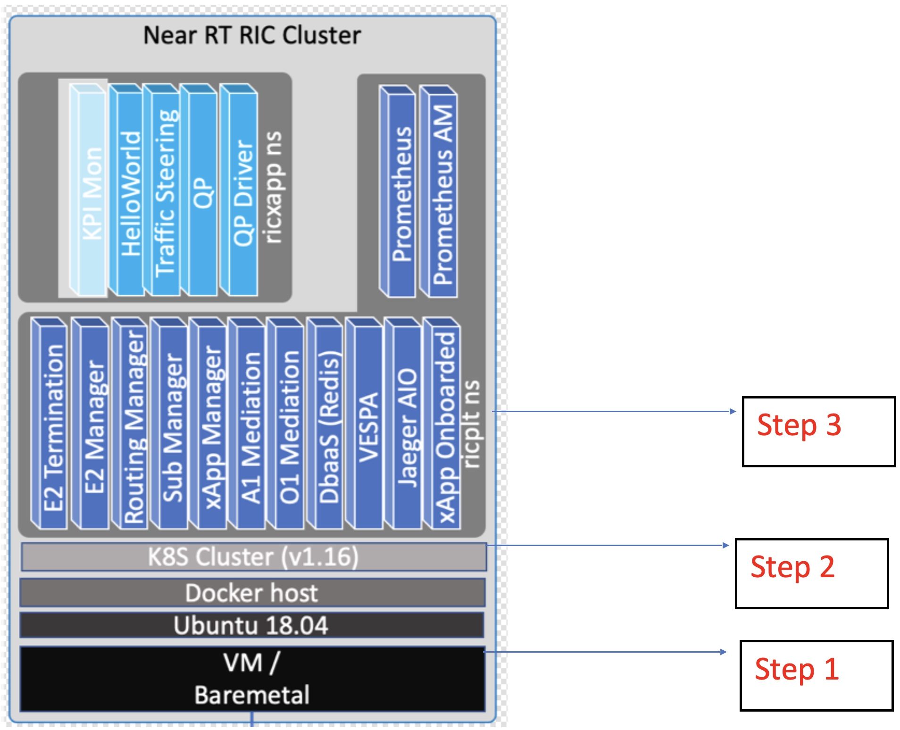

===========================================
O-RAN Near-Real Time RIC Installation Guide
===========================================

Pre-requisites
==============

System Requirements
-------------------

* OS: `Ubuntu 20.04 LTS (Bionic Beaver) <https://en.wikipedia.org/wiki/Ubuntu_version_history#:~:text=Table%20of%20versions%20%20%20%20Version%20,Future%20release%3A%202027-04-21%20%2011%20more%20rows%20>`_
* CPU(s): 2-4 vCPUs
* RAM: 6-16 GB
* Storage: 20-160 GB

O-RAN Near-Real Time RIC Software Architecture
----------------------------------------------

Near-Real Time RIC Installation Procedure
=========================================

Step 1: Install and configure an Ubuntu Host Machine/ Virtual Machine (VM)
--------------------------------------------------------------------------

The near-real time RIC can be run on a host machine or a VM as per your preference (A VM is recommended if your system is powerful enough to support multiple VMs).

In this instruction set we assume the VM/Linux host system is already configured with the specified system requirements. If you need help with VM installation on Windows 10, `check out this video <https://www.youtube.com/watch?v=x5MhydijWmc>`_.

This completes step 1.

Step 2: Install Kubernetes, Docker, and Helm
--------------------------------------------

.. note:: 

   Before you begin, please clone the parent `oaic <https://github.com/openaicellular/oaic>`_ directory as outlined in :ref:`Getting Started <gettingstarted>`.

Near-Real Time RIC
~~~~~~~~~~~~~~~~~~

The installation of Near Realtime RAN Intelligent Controller is spread onto 
two separate Kubernetes clusters.
The first cluster is used for deploying the Near Realtime RIC (platform and 
applications), and the other is for deploying other auxiliary functions.
They are referred to as **RIC cluster** and **AUX cluster** respectively [1]_.

The **RIC cluster** consists of 3 major Kubernetes Systems.
Each of them is separated by their specified namespaces (kube-system ns, 
ricinfra ns, ricplt ns):

**Kube-system ns:** The underlying Kubernetes application which provides the basic 
framework for deployment and maintenance of pods.

RIC Kubernetes Cluster Installation
~~~~~~~~~~~~~~~~~~~~~~~~~~~~~~~~~~~

The ``RIC-Deployment`` directory contains the deployment scripts and pre generated helm charts for each of the RIC components. This repository also contains some “demo” scripts which can be run after complete installation.

.. code-block:: bash

    cd ~/oaic/RIC-Deployment/tools/k8s/bin
    

This directory contains tools for generating a simple script that can help us set up a one-node Kubernetes cluster (OSC also supports a 3 node Master slave Kubernetes configuration, but we do not cover that here).

The scripts automatically read in parameters (version specifications, setting up private containers/registries) from the following files:

  - ``k8s/etc/infra.rc``: specifies the docker host, Kubernetes, and Kubernetes CNI (Cluster Networking Interfaces) versions. If left unspecified, the default version is installed.
  - ``k8s/etc/env.rc``: Normally no change needed for this file. Can specify special/custom Kubernetes Cluster components, such as running private Docker registry with self-signed certificates, or hostnames that can be only resolved via private /etc/hosts entries.
  - ``etc/openstack.rc``: (Relevant only for Open Stack VMs) If the Kubernetes cluster is deployed on Open Stack VMs, this file specifies parameters for accessing the APIs of the Open Stack installation.

For a simple installation there is no need to modify any of the above files. The files give flexibility to define our own custom Kubernetes environment if we ever need to.
Run the script which will generate the Kubernetes stack install script. Executing the below command will output a shell script called ``k8s-1node-cloud-init-k_1_16-h_2_17-d_cur.sh``. The file name indicates that we are installing Kubernetes v1.16 (k_1_16), Helm v2.17 (h_2_17) and the latest version of docker (d_cur).

.. code-block:: bash

    ./gen-cloud-init.sh

Executing the generated script ``k8s-1node-cloud-init-k_1_16-h_2_17-d_cur.sh`` will install Kubernetes, Docker and Helm with version specified in the k8s/etc/infra.c. This also installs some pods which help cluster creation, service creation and internetworking between services. Running this script will replace any existing installation of Docker host, Kubernetes, and Helm on the VM. The script will reboot the machine upon successful completion. This will take some time (approx. 15-20 mins).

.. code-block:: bash

    sudo ./k8s-1node-cloud-init-k_1_16-h_2_17-d_cur.sh

Once the machine is back up, check if all the pods in the newly installed Kubernetes Cluster are in “Running” state using,

.. code-block:: bash

    sudo kubectl get pods -A  
    
.. code-block:: rst
    or 
    sudo kubectl get pods --all-namespaces

There should be a total of **9** pods up and running in the cluster.

These pods serve as the Kubernetes Framework which will be helpful in deploying the RIC platform.
We briefly detail each of the pods’ functionality (Most of which help in networking between Kubernetes nodes) [].

  * ``CoreDNS``: DNS server that serves as the Kubernetes cluster DNS. This is a replacement for the default kube-dns service.
  * ``Flannel``: Flannel is a basic overlay network that works by assigning a
    range of subnet addresses (usually IPv4).
    To facilitate inter-container connectivity across nodes, flannel is used. 
    Flannel does not control how containers are networked to the host, only 
    how the traffic is transported between hosts. Flannel uses etcd to 
    maintain a mapping between allocated subnets and real host IP addresses. 
    For example, this is very useful when the RAN is trying to communicate 
    with the RIC since they are both different/separate nodes.
  * ``Etcd server``: Consistent and highly available key value store (similar to a dictionary or a map) used as
    Kubernetes' backing store for all cluster data.
    Example : Used by Flannel to register its container’s IP. etcd server 
    stores a key-value mapping of each container with its IP.
  * ``Kube-APIserver``: A control plane module that exposes the Kubernetes API. 
    The API server is the front end for the Kubernetes control plane. The 
    Kubernetes API server validates and configures data for the api objects 
    which include pods, services, replication controllers, and others. For 
    example, it uses etcd server as a service to get the IP mappings and 
    assign service IPs accordingly.
  * ``Kube-proxy``: Creates iptables rules and allocates static endpoints and 
    load balancing. Basically, this means, in case the node goes down or the 
    pod restarts it will get a new local IP, but the service IP created by 
    kubernetes will remain the same enabling kubernetes to route traffic to 
    correct set of pods. See [], [], [] for more details on networking in 
    docker and Kubernetes.
  * ``Kube-scheduler``: Control plane component that watches for newly created 
    Pods with no assigned node and selects a node for them to run on. The 
    scheduler determines which Nodes are valid placements for each Pod in the 
    scheduling queue according to constraints and available resources. 
    Constraints include collective resource requirements, 
    hardware/software/policy constraints, inter-workload interference, and 
    deadlines.
  * ``Kube-controller-manager``: Control plane component that runs controller 
    processes. Some examples of controller processes include node controller 
    (Responsible for noticing and responding when nodes go down), job 
    controller (Watches for Job objects that represent one-off tasks, then 
    creates Pods to run those tasks to completion) etc.
  * ``Tiller-deploy``: the server portion of Helm, typically runs inside the 
    Kubernetes cluster. Tiller is the service that communicates with the 
    Kubernetes API to manage our RIC components’ Helm packages. Discontinued 
    since Helm v3 since it was seen as a security risk. But in our 
    deployments, we are still using Helm v2, so tiller is essential.

Onetime setup for Influxdb
~~~~~~~~~~~~~~~~~~~~~~~~~~

Once Kubernetes setup is done, we have to create PersistentVolume through the storage class for the influxdb database.
The following one time process should be followed before deploying the influxdb in ricplt namespace.

    **Persistent Volume**:

First we need to check if the "ricinfra" namespace exists.

.. code-block:: rst

    sudo kubectl get ns ricinfra

If the namespace doesn’t exist, then create it using:

.. code-block:: bash

    sudo kubectl create ns ricinfra

The next three commands installs the nfs-common package for kubernetes through helm in the "ricinfra" namespace and for the system

.. code-block:: bash

    sudo helm install stable/nfs-server-provisioner --namespace ricinfra --name nfs-release-1
    sudo kubectl patch storageclass nfs -p '{"metadata": {"annotations":{"storageclass.kubernetes.io/is-default-class":"true"}}}'
    sudo apt install nfs-common
    
.. tip::

   When the RIC platform is undeployed, the ``ricinfra`` namespace will also be removed. So, you will need to run the one-time setup procedure again when re-deploying    the RIC.

NFS-common basically allows file sharing between systems residing on a local area network.

Step 3: Build Modified E2 docker Image
--------------------------------------

Pre-requisites
~~~~~~~~~~~~~~	

Local docker registry to host docker images. You can create one using, (You will need "super user" permissions)

.. code-block:: bash

    sudo docker run -d -p 5001:5000 --restart=always --name ric registry:2
 
Now you can either push or pull images using,
``docker push localhost:5001/<image_name>:<image_tag>``
or ``docker pull localhost:5001/<image_name>:<image_tag>``
 

Pulling Docker image
~~~~~~~~~~~~~~~~~~~~~

Pull the E2 termination docker image from the OAIC's DockerHub and retagging it to be hosted in the local registry

.. code-block:: bash

    sudo docker pull oaic/e2:5.5.0
    sudo docker tag oaic/e2:5.5.0 localhost:5001/ric-plt-e2:5.5.0
    sudo docker push localhost:5001/ric-plt-e2:5.5.0

This image can be used when deploying the near-real time RIC Kubernetes Cluster in the next step.

      
When the RIC platform is deployed, you will have the modified E2 Termination running on the Kubernetes cluster. The pod will be called `deployment-ricplt-e2term-alpha` and 3 services related to E2 Termination will be created:

  - ``service-ricplt-e2term-prometheus-alpha`` : Communicates with the *VES-prometheus Adapter (VESPA)* pod to send data to the SMO.
  - ``service-ricplt-e2term-rmr-alpha`` : RMR service that manages exchange of messages between E2 Termination other components in the near-real time RIC.
  - ``service-ricplt-e2term-sctp-alpha`` : Accepts SCTP connections from RAN and exchanges E2 messages with the RAN. Note that this service is configured as a *NodePort* (accepts connections external to the cluster) while the other two are configured as *ClusterIP* (Networking only within the cluster). 

Commands related to E2 Termination
~~~~~~~~~~~~~~~~~~~~~~~~~~~~~~~~~~

  - View E2 Termination logs : ``kubectl logs -f -n ricplt -l app=ricplt-e2term-alpha``
  - View E2 Manager Logs : ``kubectl logs -f -n ricplt -l app=ricplt-e2mgr``
  - Get the IP *service-ricplt-e2term-sctp-alpha* : ``kubectl get svc -n ricplt --field-selector metadata.name=service-ricplt-e2term-sctp-alpha -o jsonpath='{.items[0].spec.clusterIP}'``

Step 4: Deploy the near-Real Time RIC
-------------------------------------

Once the Kubernetes clusters are deployed, it is now time for us to deploy the near-real time RIC cluster.

.. code-block:: bash

    cd ~/oaic/RIC-Deployment/bin
    sudo ./deploy-ric-platform -f ../RECIPE_EXAMPLE/PLATFORM/example_recipe_oran_e_release_modified_e2.yaml
    
This command deploys the near-real time RIC according to the RECIPE stored in ``RIC-Deployment/RECIPE_EXAMPLE/PLATFORM/`` directory. A Recipe is an important concept for Near Realtime RIC deployment. Each deployment group has its own recipe. Recipe provides a customized specification for the components of a deployment group for a specific deployment site. The ``RECIPE_EXAMPLE`` directory contains the example recipes for the three deployment groups (bronze, cherry, dawn, e-release). The benefit of using *recipe files* is that changing over from one release to another is seamless requiring just the execution of a single script without having to perform “Step 2” all over again.

An example of changing the recipe file to suit our requirements is shown below. Instead of using the E2 Termination image provided by the O-RAN SC, we make use of the modified E2 Termination image created in the previous image. To do this, we modify the ``e2term`` section in the recipe file present in ``RIC-Deployment/RECIPE_EXAMPLE/PLATFORM`` to point to the new image,

.. code-block:: rst
   :emphasize-lines: 4,5,6

    e2term:
      alpha:
        image:
          registry: "localhost:5001"
          name: ric-plt-e2
          tag: 5.5.0
        privilegedmode: false
        hostnetworkmode: false
        env:
          print: "1"
          messagecollectorfile: "/data/outgoing/"
        dataVolSize: 100Mi
        storageClassName: local-storage
        pizpub:
          enabled: false`

Structure of the "RIC-Deployment" Directory
~~~~~~~~~~~~~~~~~~~~~~~~~~~~~~~~~~~~~~~~~~~

The scripts in the ./bin directory are one-click RIC deployment/undeployment scripts and will call the deployment/undeployment
scripts in the corresponding submodule directory respectively. In each of the submodule directories, ./bin contains
the binary and script files and ./helm contains the helm charts. For the rest of the non-submodule directories please
refer to the README.md files in them for more details.

References
----------

.. [1] https://www.youtube.com/watch?v=x5MhydijWmc
.. [2] https://docs.o-ran-sc.org/projects/o-ran-sc-it-dep/en/latest/installation-guides.html#one-node-kubernetes-cluster
.. [3] https://www.section.io/engineering-education/docker-concepts/
.. [4] https://www.aquasec.com/cloud-native-academy/docker-container/docker-architecture/
.. [5] https://kubernetes.io/docs/concepts/overview/components/
.. [6] https://www.digitalocean.com/community/tutorials/an-introduction-to-helm-the-package-manager-for-kubernetes
.. [7] https://www.velotio.com/engineering-blog/flannel-a-network-fabric-for-containers
.. [8] https://sookocheff.com/post/kubernetes/understanding-kubernetes-networking-model/
.. [9] https://kubernetes.io/docs/concepts/cluster-administration/networking/

