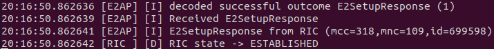
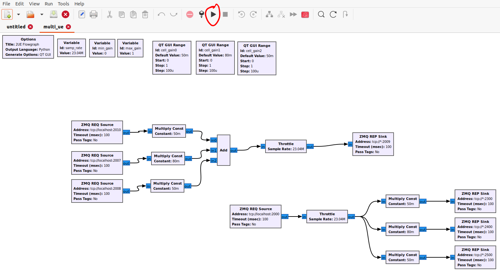

===================
Running the SS Xapp 
===================

Table of Contents
=================

* :ref:`Prerequisites`
* :ref:`Setup`
* :ref:`Deploying`
* :ref:`ZMQ`
* :ref:`USRP`
* :ref:`Running The xApp`

.. _Prerequisites:

Prerequisites 
=============

System Requirements
-------------------

* OS: `Ubuntu Desktop 20.04 LTS (Focal Fossa) <https://www.releases.ubuntu.com/focal/ubuntu-20.04.6-desktop-amd64.iso>`_ Baremetal Preferred
* `Low Latency Kernel recommended <https://unix.stackexchange.com/questions/739769/how-do-you-install-the-linux-lowlatency-kernel-and-why-does-it-stops-at-version>`_
* `Performance mode setting <https://askubuntu.com/questions/604720/setting-to-high-performance>`_
* 10 Gbps NIC (if using USRPs)
* CPU(s): 12 vCPUs (Threads)
* RAM: 16 GB minimum
* Storage: 100 GB

Hardware
--------

For ZMQ scenario:

* 1 machine

For USRP scenario:

* 3 - 4 machines (1 for EPC & eNB, 2 - 3 for UEs)
* 1 B210 for each machine
* 1 Octoclock for 10MHz reference

Software
--------

1. Deploy Near-Real Time RIC **(EPC & eNB server ONLY)**

    Follow instructions on the OAIC documentation: `O-RAN Near-Real Time RIC Installation Guide <https://openaicellular.github.io/oaic/oran_installation.html>`_

2. Next install all the required dependencies, ZMQ, UHD and asn1c Compiler

    Follow instructions on OAIC documentation for installation of dependencies, ZMQ and as1nc compiler: `srsRAN with E2 Agent Installation Guide <https://openaicellular.github.io/oaic/srsRAN_installation.html>`_. Do **NOT** follow the section that says ``srsRAN with E2 agent Installation``.

3. Clone down the srslte modified with e2

.. code-block:: bash

    cd ~/oaic
    git clone https://github.com/openaicellular/srslte-e2
    cd srslte-e2

.. code-block:: bash
    
    rm -rf build
    mkdir build
    export SRS=`realpath .`
    cd build
    cmake ../ -DCMAKE_BUILD_TYPE=RelWithDebInfo \
        -DRIC_GENERATED_E2AP_BINDING_DIR=${SRS}/e2_bindings/E2AP-v01.01 \
        -DRIC_GENERATED_E2SM_KPM_BINDING_DIR=${SRS}/e2_bindings/E2SM-KPM \
        -DRIC_GENERATED_E2SM_GNB_NRT_BINDING_DIR=${SRS}/e2_bindings/E2SM-GNB-NRT
    make -j`nproc`
    sudo make install
    sudo ldconfig
    sudo srslte_install_configs.sh user --force
    
.. warning::

    The rest of this section is for **EPC & eNB server ONLY** if you are working with USRPs and ZMQ. If you're setting up for a UE for USRPs, skip to the :ref:`USRP` section.
   
After install srslte modified, open the ``user_db.csv`` file with your preferred text editor

.. code-block:: bash

    sudo -i
    cd .config/srslte
    vim user_db.csv
    
Replace these lines of code with the existing configurations at the bottom of the file. This allows the ENB to be able to connect with 3 UEs. 

*Kept in the following format: "Name, Auth, IMSI, Key, OP_Type, OP/OPc, AMF, SQN, QCI, IP_alloc".*
   
.. code-block:: rst

    ue2,xor,001010123456780,00112233445566778899aabbccddeeff,opc,63bfa50ee6523365ff14c1f45f88737d,8000,000000001635,7,dynamic
    ue3,xor,001010123456781,00112233445566778899aabbccddeeff,opc,63bfa50ee6523365ff14c1f45f88737d,8002,0000000014eb,7,dynamic
    ue1,xor,001010123456789,00112233445566778899aabbccddeeff,opc,63bfa50ee6523365ff14c1f45f88737d,9001,00000000131b,7,dynamic

Exit out of sudo once you are done editing the file

.. code-block:: bash

    exit

We can now clone the repositories we will need to run build the xapp and onboard it as well as run multiple UEs.

.. _Setup:

Setup
=====

Install the following dependencies

.. code-block:: bash

    sudo apt install gnuradio python3-pip iperf3 -y

Under the oaic directory, run the following commands

.. code-block:: bash

    cd ~/oaic
    git clone https://github.com/openaicellular/ss-xapp.git

.. note::

    If you do not have Nginx web server setted up, head over to the  `xApp Deployment - General Guidelines <https://openaicellular.github.io/oaic/xapp_deployment.html>`_ and follow the ``Configuring the Nginx Web Server`` section **ONLY** and nothing else.

Create a symlink from the xApp’s config file. This can be replaced by another symlink in the future. Reload Nginx once this has been done.

.. code-block:: bash

    cd ~/oaic/ss-xapp
    sudo cp config-file.json /var/www/xApp_config.local/config_files/
    sudo systemctl reload nginx

Now we are going to build the xapp from the DockerFile

.. code-block:: bash

    cd ~/oaic/ss-xapp
    sudo docker build . -t xApp-registry.local:5008/ss:0.1.0

Paste the following in the ``ss-xapp-onboard.url`` file located in the ss-xapp directory. Substitute the ``<machine_ip_addr>`` with the IP address of your machine. You can find this out by pasting the command ``ifconfig`` or ``hostname -I`` in the terminal.

.. code-block:: bash

    cd ~/oaic/ss-xapp
    vim ss-xapp-onboard.url

.. code-block:: bash

    {"config-file.json_url":"http://<machine_ip_addr>:5010/config_files/config-file.json"}
    
.. _ZMQ:

Starting the network with ZMQ
-----------------------------

.. note::

    If you are using USRPs, head to :ref:`USRP`. 

**Terminal 1**: Start the Core Network/Add Ues to Network Namespace

.. code-block:: bash

    sudo ip netns add ue1
    sudo ip netns add ue2
    sudo ip netns add ue3
    sudo ip netns list    
    sudo srsepc 

**Terminal 2**: Set up Environment Variables and Base Station

.. code-block:: bash

    export E2NODE_IP=`hostname  -I | cut -f1 -d' '`
    export E2NODE_PORT=5006
    export E2TERM_IP=`sudo kubectl get svc -n ricplt --field-selector metadata.name=service-ricplt-e2term-sctp-alpha -o jsonpath='{.items[0].spec.clusterIP}'`
    
.. code-block:: bash
       
    sudo srsenb --enb.n_prb=100 --enb.name=enb1 --enb.enb_id=0x19B \
    --rf.device_name=zmq --rf.device_args="fail_on_disconnect=true,tx_port=tcp://*:2000,rx_port=tcp://localhost:2009,id=enb,base_srate=23.04e6" --ric.agent.remote_ipv4_addr=${E2TERM_IP} --log.all_level=warn --ric.agent.log_level=debug --log.filename=stdout --ric.agent.local_ipv4_addr=${E2NODE_IP} --ric.agent.local_port=${E2NODE_PORT} --slicer.enable=1 --slicer.workshare=0

.. warning::

    Make sure you can see the eNB have a RIC State Establish message as shown in the image below before proceeding.

.. note::

    If you are not getting a RIC State Established message, you need to restart the e2term-alpha pod by using the command: ``sudo kubectl delete pod -n ricplt -l app=ricplt-e2term-alpha``. If that still doesn't work, undeploy and redeploy the near-realtime RIC.

**Terminal 3**: Set up the first UE

.. code-block:: bash

    sudo srsue \
    --rf.device_name=zmq --rf.device_args="tx_port=tcp://*:2010,rx_port=tcp://localhost:2300,id=ue,base_srate=23.04e6" --usim.algo=xor --usim.imsi=001010123456789 --usim.k=00112233445566778899aabbccddeeff --usim.imei=353490069873310 --log.all_level=warn --log.filename=stdout --gw.netns=ue1

**Terminal 4**: Set up the second UE

.. code-block:: bash

    sudo srsue \
    --rf.device_name=zmq --rf.device_args="tx_port=tcp://*:2007,rx_port=tcp://localhost:2400,id=ue,base_srate=23.04e6" --usim.algo=xor --usim.imsi=001010123456780 --usim.k=00112233445566778899aabbccddeeff --usim.imei=353490069873310 --log.all_level=warn --log.filename=stdout --gw.netns=ue2
    
**Terminal 5**: Set up the third UE

.. code-block:: bash

    sudo srsue \
    --rf.device_name=zmq --rf.device_args="tx_port=tcp://*:2008,rx_port=tcp://localhost:2500,id=ue,base_srate=23.04e6" --usim.algo=xor --usim.imsi=001010123456781 --usim.k=00112233445566778899aabbccddeeff --usim.imei=353490069873310 --log.all_level=warn --log.filename=stdout --gw.netns=ue3

GUI
~~~

Open the ``GNU Radio Companion`` App. It should be installed when installing the gnuradio package. Open the ``multi_ue.grc`` file located in the ~/oaic/ss-xapp directory.

Press play as marked in the image below. This allows the UEs to attach to the eNodeB base station.

No GUI
~~~~~~

.. note::

    If you have already ran the GNU Radio Companion Application, skip this step.

If you running without a GUI, open a new terminal and run the following commands:

.. code-block:: bash

    cd ~/oaic/ss-xapp
    python3 multi_ue.py

Iperf3
~~~~~~

.. note::

    Execute the next commands each in a separate terminal

**Terminal 6/7/8**: Set up iperf3 test on the server side

.. code-block:: bash
   
    iperf3 -s -B 172.16.0.1 -p 5006 -i 1

.. code-block:: bash

    iperf3 -s -B 172.16.0.1 -p 5020 -i 1 

.. code-block:: bash

    iperf3 -s -B 172.16.0.1 -p 5021 -i 1

.. note::

    Execute the next commands each in a separate terminal

**Terminal 9/10/11**: Set up iperf3 test on the client side

We add an additional bandwidth argument "-b xxM" on each iperf3 test on client side to create a scenario of UEs trying to access more or less of resources on the network. If a UE surpasses the pre-determined threshold for amount of data packets transmitted, it is considered as malicious by the SS xApp.

.. code-block:: bash

   sudo ip netns exec ue1 iperf3 -c 172.16.0.1 -p 5006 -i 1 -t 36000 -R -b 40M

.. code-block:: bash

   sudo ip netns exec ue2 iperf3 -c 172.16.0.1 -p 5020 -i 1 -t 36000 -R -b 10M

.. code-block:: bash

   sudo ip netns exec ue3 iperf3 -c 172.16.0.1 -p 5021 -i 1 -t 36000 -R -b 15M

You should notice traffic flow on both the server and client side for both UEs.

Move on to the :ref:`Deploying` section for deploying the xApp

.. _USRP:

Starting the network with USRPs
-------------------------------

.. note::

    If you already started the network using ZMQ, you can head to the :ref:`Deploying` section

For better performance of USRPs, we use the CDA-2990 Octoclock as an external clock reference source for the B210s. To ensure that the B210s recognize the source, we have to add an extra argument "clock=external" on the eNodeB and UE commands.

.. image:: b210octaclock.png
    :width: 80%
    :alt: B210 with Octoclock Setup

Connect the SMA cables from each of the 10 MHz out of the Octoclock to the REF IN port for the B210 as shown in the picture.

Connect the two Antennas in the RF A section for both the TX/RX and RX2 ports.

Connect the USB port from the B210 to your machines. 

Before starting the network, check to see if each machine recognizes the USRPs by using the following command.

.. code-block:: bash

    sudo uhd_images_downloader
    sudo uhd_find_devices

Install iperf3 for all machines if not already done so.

.. code-block:: bash

    sudo apt install iperf3 -y

**Machine 1 - Terminal 1**: Start the Core Network on server side (eNodeB server)

.. code-block:: bash
  
    sudo srsepc 

**Machine 1 - Terminal 2**: Set up Environment Variables and Base Station

.. code-block:: bash

    export E2NODE_IP=`hostname  -I | cut -f1 -d' '`
    export E2NODE_PORT=5006
    export E2TERM_IP=`sudo kubectl get svc -n ricplt --field-selector metadata.name=service-ricplt-e2term-sctp-alpha -o jsonpath='{.items[0].spec.clusterIP}'`
    
.. code-block:: bash
       
    sudo srsenb --enb.n_prb=100 --enb.name=enb1 --enb.enb_id=0x19B --rf.device_name=uhd --rf.device_args="clock=external" --ric.agent.remote_ipv4_addr=${E2TERM_IP} --log.all_level=warn --ric.agent.log_level=debug --log.filename=stdout --ric.agent.local_ipv4_addr=${E2NODE_IP} --ric.agent.local_port=${E2NODE_PORT} --slicer.enable=1 --slicer.workshare=0

.. warning::

    Make sure you can see the eNB have a RIC State Establish message as shown in the image below before proceeding.

.. note::

    If you are not getting a RIC State Established message, you need to restart the e2term-alpha pod by using the command: ``sudo kubectl delete pod -n ricplt -l app=ricplt-e2term-alpha``. If that still doesn't work, undeploy and redeploy the near-realtime RIC.

**Machine 2 - Terminal 1**: Set up the first UE

.. code-block:: bash
    
    sudo srsue \
    --rf.device_name=uhd --rf.device_args="clock=external" --usim.algo=xor --usim.imsi=001010123456789 --usim.k=00112233445566778899aabbccddeeff --usim.imei=353490069873310  --log.all_level=warn --log.filename=stdout

**Machine 3 - Terminal 1**: Set up the second UE

.. code-block:: bash

    sudo srsue \
    --rf.device_name=uhd --rf.device_args="clock=external" --usim.algo=xor --usim.imsi=001010123456780 --usim.k=00112233445566778899aabbccddeeff --usim.imei=353490069873310  --log.all_level=warn --log.filename=stdout
    
**Machine 4 - Terminal 1**: Set up the third UE (If you have one)

.. code-block:: bash

    sudo srsue \
    --rf.device_name=uhd --rf.device_args="clock=external" --usim.algo=xor --usim.imsi=001010123456781 --usim.k=00112233445566778899aabbccddeeff --usim.imei=353490069873310  --log.all_level=warn --log.filename=stdout

**Machine 1 - Terminal 3/4/5**: Set up iperf3 test on the server side (eNodeB server)

.. code-block:: bash
   
   iperf3 -s -B 172.16.0.1 -p 5006 -i 1

.. code-block:: bash

   iperf3 -s -B 172.16.0.1 -p 5020 -i 1 

.. code-block:: bash

   iperf3 -s -B 172.16.0.1 -p 5021 -i 1 # If you have a third UE

**Machine 2/3/4 - Terminal 2**: Set up iperf3 test on the client side (UE servers)

We add an additional bandwidth argument "-b xxM" on each iperf3 test on client side to create a scenario of UEs trying to access more or less of resources on the network. If a UE surpasses the pre-determined threshold for amount of data packets transmitted, it is considered as malicious by the SS xApp.

.. code-block:: bash

   sudo iperf3 -c 172.16.0.1 -p 5006 -i 1 -t 36000 -R -b 40M

.. code-block:: bash

   sudo iperf3 -c 172.16.0.1 -p 5020 -i 1 -t 36000 -R -b 10M

.. code-block:: bash

   sudo iperf3 -c 172.16.0.1 -p 5021 -i 1 -t 36000 -R -b 15M # If you have a third UE

You should notice traffic flow on both the server and client side for all three UEs. Move on to the next step.

.. _Deploying:
    
Deploying the SS xApp
=====================

.. code-block:: bash

    cd ~/oaic/ss-xapp

.. code-block:: bash
    
    export KONG_PROXY=`sudo kubectl get svc -n ricplt -l app.kubernetes.io/name=kong -o jsonpath='{.items[0].spec.clusterIP}'`
    export E2MGR_HTTP=`sudo kubectl get svc -n ricplt --field-selector metadata.name=service-ricplt-e2mgr-http -o jsonpath='{.items[0].spec.clusterIP}'`
    export APPMGR_HTTP=`sudo kubectl get svc -n ricplt --field-selector metadata.name=service-ricplt-appmgr-http -o jsonpath='{.items[0].spec.clusterIP}'`
    export E2TERM_SCTP=`sudo kubectl get svc -n ricplt --field-selector metadata.name=service-ricplt-e2term-sctp-alpha -o jsonpath='{.items[0].spec.clusterIP}'`
    export ONBOARDER_HTTP=`sudo kubectl get svc -n ricplt --field-selector metadata.name=service-ricplt-xapp-onboarder-http -o jsonpath='{.items[0].spec.clusterIP}'`
    export RTMGR_HTTP=`sudo kubectl get svc -n ricplt --field-selector metadata.name=service-ricplt-rtmgr-http -o jsonpath='{.items[0].spec.clusterIP}'`

.. code-block:: bash

    curl -L -X POST "http://$KONG_PROXY:32080/onboard/api/v1/onboard/download" --header 'Content-Type: application/json' --data-binary "@ss-xapp-onboard.url"
    curl -L -X GET "http://$KONG_PROXY:32080/onboard/api/v1/charts"
    curl -L -X POST "http://$KONG_PROXY:32080/appmgr/ric/v1/xapps" --header 'Content-Type: application/json' --data-raw '{"xappName": "ss"}'

.. warning::

    If you are repeating an experiement, you may want to restart the pod using the command below. By doing so, you do not have to undeploy and redeploy the xApp again.
    
.. code-block:: bash

    sudo kubectl -n ricxapp rollout restart deployment ricxapp-ss

.. _Running The xApp:

Running the xApp
================

In your EPC & eNB server's terminal, print the logs for the SS xApp

.. note::

    The SS xApp has to be deployed in order for this to work.

.. code-block:: bash

    sudo kubectl logs -f -n ricxapp -l app=ricxapp-ss

Now run the test script with the following commands on a separate terminal, depending on the number of UEs you have.

Two UEs
-------

.. code-block:: bash

    cd ~/oaic/ss-xapp
    sudo chmod +x zmqtwoue.sh
    sudo ./zmqtwoue.sh

Three UEs
---------

.. code-block:: bash

    cd ~/oaic/ss-xapp
    sudo chmod +x zmqthreeue.sh
    sudo ./zmqthreeue.sh

After a short time you can observe through the logs that UE1 will be considered malicious and moved to a different slice. You also observe the traffic exchange for UE1 will significantly decrease. 
	
.. note::

   To run the script again, you have to restart the SS xApp and redeploy the network again.	
   
.. code-block:: bash

    sudo kubectl -n ricxapp rollout restart deployment ricxapp-ss

